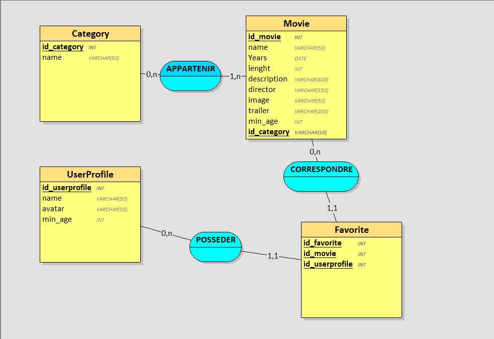

# SAE 2.03 - Documentation des Itérations 

## Vue d'ensemble du projet
Application web de streaming de films avec profils utilisateur et gestion des favoris.

---

## Diagramme de la Base de Données



### Cardinalités expliquées :
- **Category (1) ↔ (n) Movie** : Une catégorie peut contenir plusieurs films, mais chaque film n'appartient qu'à une catégorie (ou aucune).
- **UserProfile (1) ↔ (n) Favorite** : Un profil peut avoir plusieurs favoris.
- **Movie (1) ↔ (n) Favorite** : Un film peut être dans les favoris de plusieurs profils.

---

## ITÉRATION 1 : Consulter la liste des films

### User Story
En tant que visiteur, je veux consulter la liste des films disponibles pour découvrir les films proposés.

## Base de données
Aucune nouvelle table n'a été créée. Utilisation des tables existante.
### Requêtes SQL Utilisées

#### Requête principale : Récupérer tous les films avec leur catégorie
```sql
SELECT m.id, m.name, m.image, m.trailer, c.name as category 
FROM Movie m 
LEFT JOIN Category c ON m.id_category = c.id 
ORDER BY c.name, m.name;
```

**Endpoint:** `script.php?todo=readmovies`

**Code PHP (model.php) :**
```php
function getAllMovies($minAge = null){
    $cnx = getConnection();
    $sql = "select m.id, m.name, m.image, m.trailer, c.name as category 
            from Movie m LEFT JOIN Category c ON m.id_category = c.id";
    
    if ($minAge !== null) {
        $sql = $sql . " WHERE m.min_age <= :minAge";
    }
    
    $sql = $sql . " ORDER BY c.name, m.name";
    
    $stmt = $cnx->prepare($sql);
    
    if ($minAge !== null) {
        $stmt->execute(array(':minAge' => $minAge));
    } else {
        $stmt->execute();
    }
    
    $films = $stmt->fetchAll(PDO::FETCH_OBJ);
    return $films;
}
```

### Flux Frontend

1. **app/data/dataMovie.js** : Fonction `DataMovie.requestMovies()` effectue la requête HTTP
2. **app/component/Movie** : Composant pour afficher chaque film (titre + image)
3. **app/component/MovieCard** : Affichage en cartes visuel

---

## ITÉRATION 2 : Ajouter des films (Admin)

### User Story
En tant qu'administrateur, je veux ajouter des films dans la base de données.

### Modifications Base de Données
Aucune nouvelle table n'a été créée. Utilisation de la table `Movie` existante.

### Requêtes SQL Utilisées
#### Requête : Insérer un nouveau film
```sql
INSERT INTO Movie (name, director, year, length, description, id_category, image, trailer, min_age) 
VALUES (:title, :director, :year, :duration, :description, :categoryId, :image, :trailer, :minAge)
```

**Endpoint:** `script.php?todo=addmovie` (POST)

**Code PHP (model.php) :**
```php
function insertMovie($title, $director, $year, $duration, $description, $categoryId, $image, $trailer, $ageRestriction){
    $cnx = getConnection();
    
    // Vérifier que la catégorie existe
    $sqlCategory = "SELECT id FROM Category WHERE id = :categoryId";
    $stmtCategory = $cnx->prepare($sqlCategory);
    $stmtCategory->execute(array(':categoryId' => $categoryId));
    $categoryResult = $stmtCategory->fetch(PDO::FETCH_OBJ);
    
    if (!$categoryResult) {
        return false;
    }
    
    $minAge = intval($ageRestriction);
    
    $sql = "INSERT INTO Movie (name, director, year, length, description, id_category, image, trailer, min_age) 
            VALUES (:title, :director, :year, :duration, :description, :categoryId, :image, :trailer, :minAge)";
    
    $stmt = $cnx->prepare($sql);
    $result = $stmt->execute(array(
        ':title' => $title,
        ':director' => $director,
        ':year' => $year,
        ':duration' => $duration,
        ':description' => $description,
        ':categoryId' => $categoryId,
        ':image' => $image,
        ':trailer' => $trailer,
        ':minAge' => $minAge
    ));
    
    return $result;
}
```

### Flux Frontend

1. **admin/data/dataMovie.js** : Fonction `DataMovie.add()` envoie les données en POST
2. **admin/component/MovieForm** : Formulaire pour saisir les informations du film
3. **admin/index.html** : Handler `C.handlerAddMovie()` gère la soumission
4. **admin/component/Log** : Affiche le message de confirmation/erreur

---

## ITÉRATION 3 : Consulter les détails d'un film

### User Story
En tant qu'utilisateur, je veux consulter les informations détaillées d'un film et visionner son trailer.

### Modifications Base de Données
Aucune modification - utilisation des tables existantes.

### Requêtes SQL Utilisées

#### Requête : Récupérer les détails d'un film
```sql
SELECT m.id, m.name, m.image, m.trailer, m.description, m.director, m.year, m.length, m.min_age, c.name as category 
FROM Movie m 
LEFT JOIN Category c ON m.id_category = c.id 
WHERE m.id = :id
```

**Endpoint:** `script.php?todo=readmoviedetail&id=X`

**Code PHP (model.php) :**
```php
function getMovieDetails($movieId){
    $cnx = getConnection();
    $sql = "SELECT m.id, m.name, m.image, m.trailer, m.description, m.director, m.year, m.length, m.min_age, c.name as category 
            FROM Movie m 
            LEFT JOIN Category c ON m.id_category = c.id 
            WHERE m.id = :id";
    $stmt = $cnx->prepare($sql);
    $stmt->execute(array(':id' => $movieId));
    $res = $stmt->fetch(PDO::FETCH_OBJ);
    return $res;
}
```

### Flux Frontend

1. **app/data/dataMovie.js** : Fonction `DataMovie.requestMovieDetails(id)` récupère les détails
2. **app/component/MovieDetail** : Affiche le synopsis, réalisateur, année, catégorie, trailer
3. **app/component/Movie** : Rendu cliquable avec `onclick="C.handlerDetail(X)"`
4. **app/component/NavBar** : Bouton pour revenir à la liste
5. **app/index.html** : Handler `C.handlerDetail()` gère l'affichage

---

## ITÉRATION 4 : Regrouper les films par catégorie

### User Story
En tant qu'utilisateur, je veux voir les films regroupés par catégorie pour naviguer facilement.

### Modifications Base de Données
Aucune modification - utilisation des tables existantes.

### Requêtes SQL Utilisées

#### Requête : Récupérer tous les films avec leurs catégories
```sql
SELECT m.id, m.name, m.image, m.trailer, c.name as category 
FROM Movie m 
LEFT JOIN Category c ON m.id_category = c.id 
ORDER BY c.name, m.name
```

**Endpoint:** `script.php?todo=readmovies`

**Code PHP (controller.php) :**
```php
function readMoviesController(){
    $age = null;
    if (isset($_REQUEST['age'])) {
        $age = (int)$_REQUEST['age'];
    }
    
    $films = getAllMovies($age);
    
    // Regroupement par catégorie au niveau du contrôleur
    $grouped = array();
    for ($i = 0; $i < count($films); $i++) {
        $film = $films[$i];
        $category = $film->category;
        
        if ($category == null || $category == '') {
            $category = 'Sans catégorie';
        }
        
        if (!isset($grouped[$category])) {
            $grouped[$category] = array();
        }
        
        $grouped[$category][] = $film;
    }
    
    // Formatage pour le frontend
    $result = array();
    $categories = array_keys($grouped);
    for ($i = 0; $i < count($categories); $i++) {
        $category = $categories[$i];
        $result[] = array('category' => $category, 'movies' => $grouped[$category]);
    }
    
    return $result;
}
```

**Optimisation :** Le regroupement se fait au niveau du contrôleur pour minimiser la charge client et éviter impacter la réactivité de l'interface.

### Flux Frontend

1. **app/component/MovieCategory** : Affiche le nom d'une catégorie et ses films
2. **app/component/Movie** : Composant réutilisé pour chaque film
3. **app/index.html** : Boucle sur les catégories reçues

---

## ITÉRATION 5 : Ajouter des profils utilisateur (Admin)

### User Story
En tant qu'administrateur, je veux ajouter des profils utilisateur.

### Structure de la Base de Données

#### Table `UserProfile` (créée à cette itération)
```sql
CREATE TABLE `UserProfile` (
  `id` int(11) NOT NULL AUTO_INCREMENT,
  `name` varchar(255) NOT NULL,
  `avatar` varchar(255) DEFAULT NULL,
  `min_age` int(11) DEFAULT 0,
  PRIMARY KEY (`id`)
) ENGINE=InnoDB DEFAULT CHARSET=utf8;
```

**Justification des choix :**
- `id` : AUTO_INCREMENT pour identifier chaque profil uniquement
- `name` : VARCHAR(255) pour le nom du profil (ex. "Parent", "Enfant")
- `avatar` : VARCHAR(255) facultatif pour le chemin de l'image/avatar
- `min_age` : INT pour l'âge minimum recommandé (0 = tous publics)

### Requêtes SQL Utilisées

#### Requête : Insérer un nouveau profil
```sql
INSERT INTO UserProfile (name, avatar, min_age) 
VALUES (:name, :avatar, :minAge)
```

**Endpoint:** `script.php?todo=addprofile` (POST)

**Code PHP (model.php) :**
```php
function insertProfile($name, $avatar, $minAge){
    $cnx = getConnection();
    
    $sql = "INSERT INTO UserProfile (name, avatar, min_age) 
            VALUES (:name, :avatar, :minAge)";
    
    $stmt = $cnx->prepare($sql);
    $result = $stmt->execute(array(
        ':name' => $name,
        ':avatar' => $avatar,
        ':minAge' => $minAge
    ));
    
    return $result;
}
```

### Flux Frontend

1. **admin/data/dataProfile.js** : Fonction `DataProfile.add()` envoie les données en POST
2. **admin/component/ProfileForm** : Formulaire pour saisir les informations du profil
3. **admin/index.html** : Handler `C.handlerAddProfile()` gère la soumission
4. **admin/component/Log** : Affiche le message de confirmation/erreur

---

## ITÉRATION 6 : Sélectionner un profil utilisateur

### User Story
En tant qu'utilisateur, je veux sélectionner un profil pour personnaliser mon expérience.

### Modifications Base de Données
Aucune modification - utilisation de la table `UserProfile` existante.

### Requêtes SQL Utilisées

#### Requête : Récupérer tous les profils
```sql
SELECT id, name, avatar, min_age FROM UserProfile ORDER BY name
```

**Endpoint:** `script.php?todo=readprofiles`

**Code PHP (model.php) :**
```php
function getAllProfiles(){
    $cnx = getConnection();
    $sql = "SELECT id, name, avatar, min_age FROM UserProfile ORDER BY name";
    $stmt = $cnx->prepare($sql);
    $stmt->execute();
    $res = $stmt->fetchAll(PDO::FETCH_OBJ);
    return $res;
}
```

### Flux Frontend

1. **app/data/dataProfile.js** : Fonction `DataProfile.read()` récupère les profils disponibles
2. **app/component/NavBar** : Affiche une liste/menu pour sélectionner un profil
3. **app/index.html** : Variable globale pour stocker l'ID du profil actif
4. Gestion du changement de profil avec rechargement des données

---

## ITÉRATION 7 : Filtrer les films selon l'âge du profil

### User Story
En tant qu'utilisateur, je veux que les contenus soient filtrés selon les restrictions d'âge de mon profil.

### Modifications Base de Données
Aucune modification - utilisation des tables existantes.

### Requêtes SQL Utilisées

#### Requête : Récupérer les films filtrés par âge
```sql
SELECT m.id, m.name, m.image, m.trailer, c.name as category 
FROM Movie m 
LEFT JOIN Category c ON m.id_category = c.id 
WHERE m.min_age <= :minAge
ORDER BY c.name, m.name
```

**Endpoint:** `script.php?todo=readmovies&age=X`

**Code PHP (model.php) - fonction modifiée :**
```php
function getAllMovies($minAge = null){
    $cnx = getConnection();
    $sql = "select m.id, m.name, m.image, m.trailer, c.name as category 
            from Movie m LEFT JOIN Category c ON m.id_category = c.id";
    
    if ($minAge !== null) {
        $sql = $sql . " WHERE m.min_age <= :minAge";
    }
    
    $sql = $sql . " ORDER BY c.name, m.name";
    
    $stmt = $cnx->prepare($sql);
    
    if ($minAge !== null) {
        $stmt->execute(array(':minAge' => $minAge));
    } else {
        $stmt->execute();
    }
    
    $films = $stmt->fetchAll(PDO::FETCH_OBJ);
    return $films;
}
```

### Flux Frontend

1. **app/data/dataMovie.js** : Fonction `DataMovie.requestMovies(age)` prend l'âge du profil en paramètre
2. **app/index.html** : Passe `currentProfile.min_age` lors de l'appel à `requestMovies()`
3. Filtrage côté serveur pour optimiser la bande passante

---

## ITÉRATION 8 : Modifier un profil utilisateur (Admin)

### User Story
En tant qu'administrateur, je veux modifier les informations d'un profil utilisateur.

### Modifications Base de Données
Aucune modification - utilisation de la table `UserProfile` existante.

### Requêtes SQL Utilisées

#### Requête : Mettre à jour un profil existant
```sql
UPDATE UserProfile 
SET name = :name, avatar = :avatar, min_age = :minAge 
WHERE id = :id
```

**Endpoint:** `script.php?todo=updateprofile` (POST)

**Code PHP (model.php) :**
```php
function updateProfile($id, $name, $avatar, $minAge){
    $cnx = getConnection();
    
    $sql = "UPDATE UserProfile 
            SET name = :name, avatar = :avatar, min_age = :minAge 
            WHERE id = :id";
    
    $stmt = $cnx->prepare($sql);
    
    $stmt->bindParam(':id', $id);
    $stmt->bindParam(':name', $name);
    $stmt->bindParam(':avatar', $avatar);
    $stmt->bindParam(':minAge', $minAge);
    
    $stmt->execute();
    
    $res = $stmt->rowCount();
    
    return $res;
}
```

### Flux Frontend

1. **admin/data/dataProfile.js** : Fonction pour récupérer les profils et mettre à jour
2. **admin/component/ProfileForm** : Formulaire pré-rempli avec les données du profil
3. **admin/component/ProfileUpdate** : Gestion de la modification
4. **admin/index.html** : Handler pour soumettre les modifications

---

## ITÉRATION 9 : Ajouter des films aux favoris

### User Story
En tant qu'utilisateur, je veux ajouter des films à une liste de favoris pour mon profil.

### Structure de la Base de Données

#### Table `Favorite` (créée à cette itération)
```sql
CREATE TABLE Favorite (
    id INT AUTO_INCREMENT PRIMARY KEY,
    id_profile INT NOT NULL,
    id_movie INT NOT NULL,
    FOREIGN KEY (id_profile) REFERENCES UserProfile(id),
    FOREIGN KEY (id_movie) REFERENCES Movie(id),
    UNIQUE KEY unique_favorite (id_profile, id_movie)
);
```

**Justification des choix :**
- `id` : AUTO_INCREMENT pour identifier chaque favori uniquement
- `id_profile` : Clé étrangère vers UserProfile (relation 1,n)
- `id_movie` : Clé étrangère vers Movie (relation 1,n)
- `UNIQUE KEY` : Assure qu'un film n'apparaît qu'une seule fois par profil

### Requêtes SQL Utilisées

#### Requête 1 : Ajouter un film aux favoris
```sql
INSERT INTO Favorite (id_profile, id_movie) 
VALUES (:id_profile, :id_movie)
```

#### Requête 2 : Vérifier que le profil existe
```sql
SELECT id FROM UserProfile WHERE id = :id_profile
```

#### Requête 3 : Vérifier que le film existe
```sql
SELECT id FROM Movie WHERE id = :id_movie
```

#### Requête 4 : Vérifier si le film est déjà en favori
```sql
SELECT id_profile FROM Favorite 
WHERE id_profile = :id_profile AND id_movie = :id_movie
```

**Endpoint:** `script.php?todo=addfavorite&profileId=X&movieId=Y` (POST/GET)

**Code PHP (model.php) :**
```php
function addFavorite($id_profile, $id_movie){
    $cnx = getConnection();
    
    $id_profile = (int)$id_profile;
    $id_movie = (int)$id_movie;
    
    // Vérifier que le profil existe
    $sql = "SELECT id FROM UserProfile WHERE id = :id_profile";
    $stmt = $cnx->prepare($sql);
    $stmt->execute(array(':id_profile' => $id_profile));
    $profil = $stmt->fetch(PDO::FETCH_OBJ);
    
    if (!$profil) {
        return false;
    }
    
    // Vérifier que le film existe
    $sql = "SELECT id FROM Movie WHERE id = :id_movie";
    $stmt = $cnx->prepare($sql);
    $stmt->execute(array(':id_movie' => $id_movie));
    $film = $stmt->fetch(PDO::FETCH_OBJ);
    
    if (!$film) {
        return false;
    }
    
    // Vérifier que c'est pas déjà dans les favoris
    $sql = "SELECT id_profile FROM Favorite 
            WHERE id_profile = :id_profile AND id_movie = :id_movie";
    $stmt = $cnx->prepare($sql);
    $stmt->execute(array(':id_profile' => $id_profile, ':id_movie' => $id_movie));
    $favori = $stmt->fetch(PDO::FETCH_OBJ);
    
    if ($favori) {
        return true;
    }
    
    // Ajouter aux favoris
    $sql = "INSERT INTO Favorite (id_profile, id_movie) 
            VALUES (:id_profile, :id_movie)";
    $stmt = $cnx->prepare($sql);
    $resultat = $stmt->execute(array(':id_profile' => $id_profile, ':id_movie' => $id_movie));
    
    return $resultat;
}
```

### Flux Frontend

1. **app/data/dataMovie.js** : Fonction `DataMovie.addFavorite(profileId, movieId)` envoie la requête
2. **app/component/MovieDetail** ou **MovieCard** : Bouton/icône pour ajouter aux favoris
3. **app/index.html** : Handler pour l'ajout aux favoris
4. **app/component/Log** : Message de confirmation

---

## ITÉRATION 10 : Retirer des films des favoris

### User Story
En tant qu'utilisateur, je veux retirer des films de ma liste de favoris.

### Modifications Base de Données
Aucune modification - utilisation de la table `Favorite` existante.

### Requêtes SQL Utilisées

#### Requête : Supprimer un film des favoris
```sql
DELETE FROM Favorite 
WHERE id_profile = :id_profile AND id_movie = :id_movie
```

**Endpoint:** `script.php?todo=removefavorite&profileId=X&movieId=Y`

**Code PHP (model.php) :**
```php
function removeFavorite($id_profile, $id_movie){
    $cnx = getConnection();
    
    $id_profile = (int)$id_profile;
    $id_movie = (int)$id_movie;
    
    // Vérifier que le profil existe
    $sql = "SELECT id FROM UserProfile WHERE id = :id_profile";
    $stmt = $cnx->prepare($sql);
    $stmt->execute(array(':id_profile' => $id_profile));
    $profil = $stmt->fetch(PDO::FETCH_OBJ);
    
    if (!$profil) {
        return false;
    }
    
    // Vérifier que le film existe
    $sql = "SELECT id FROM Movie WHERE id = :id_movie";
    $stmt = $cnx->prepare($sql);
    $stmt->execute(array(':id_movie' => $id_movie));
    $film = $stmt->fetch(PDO::FETCH_OBJ);
    
    if (!$film) {
        return false;
    }
    
    // Supprimer le film des favoris
    $sql = "DELETE FROM Favorite 
            WHERE id_profile = :id_profile AND id_movie = :id_movie";
    $stmt = $cnx->prepare($sql);
    $resultat = $stmt->execute(array(':id_profile' => $id_profile, ':id_movie' => $id_movie));
    
    return $resultat;
}

function getFavoritesByProfile($id_profile){
    $cnx = getConnection();
    
    // Récupère les favoris avec les infos des films et catégories
    $sql = "SELECT m.id, m.name, m.image, m.trailer, c.name as category 
            FROM Favorite f
            JOIN Movie m ON f.id_movie = m.id
            LEFT JOIN Category c ON m.id_category = c.id
            WHERE f.id_profile = :id_profile
            ORDER BY c.name, m.name";
    
    $stmt = $cnx->prepare($sql);
    $stmt->execute(array(':id_profile' => $id_profile));
    $res = $stmt->fetchAll(PDO::FETCH_OBJ);
    
    return $res;
}
```

### Flux Frontend

1. **app/data/dataMovie.js** : Fonction `DataMovie.removeFavorite(profileId, movieId)` envoie la requête
2. **app/component/MovieDetail** ou **Favorites** : Bouton/icône pour retirer des favoris
3. **app/index.html** : Handler pour la suppression
4. **app/component/Log** : Message de confirmation

---

## Résumé des Cardinalités

| Relation | Cardinalité | Explication |
|----------|-------------|-------------|
| Category → Movie | (0, n) | Une catégorie peut avoir plusieurs films et pour faciliter l'intégration à la base de données on y mets 0 puisque une catégorie peut ne pas avoir de film |
| Movie → Category | (1, n) | Un film n'a qu'une catégorie (ou aucune) |
| UserProfile → Favorite | (0, n) | Un profil peut avoir plusieurs favoris sans obligatoirement en avoir 1 |
| Favorite → UserProfile | (1, 1) | Un favori n'appartient qu'à un profil |
| Movie → Favorite | (0, n) | Un film peut être en favori chez plusieurs profils sans obligatoirement être en favoris |
| Favorite → Movie | (1, 1) | Un favori correspond à un seul film |
